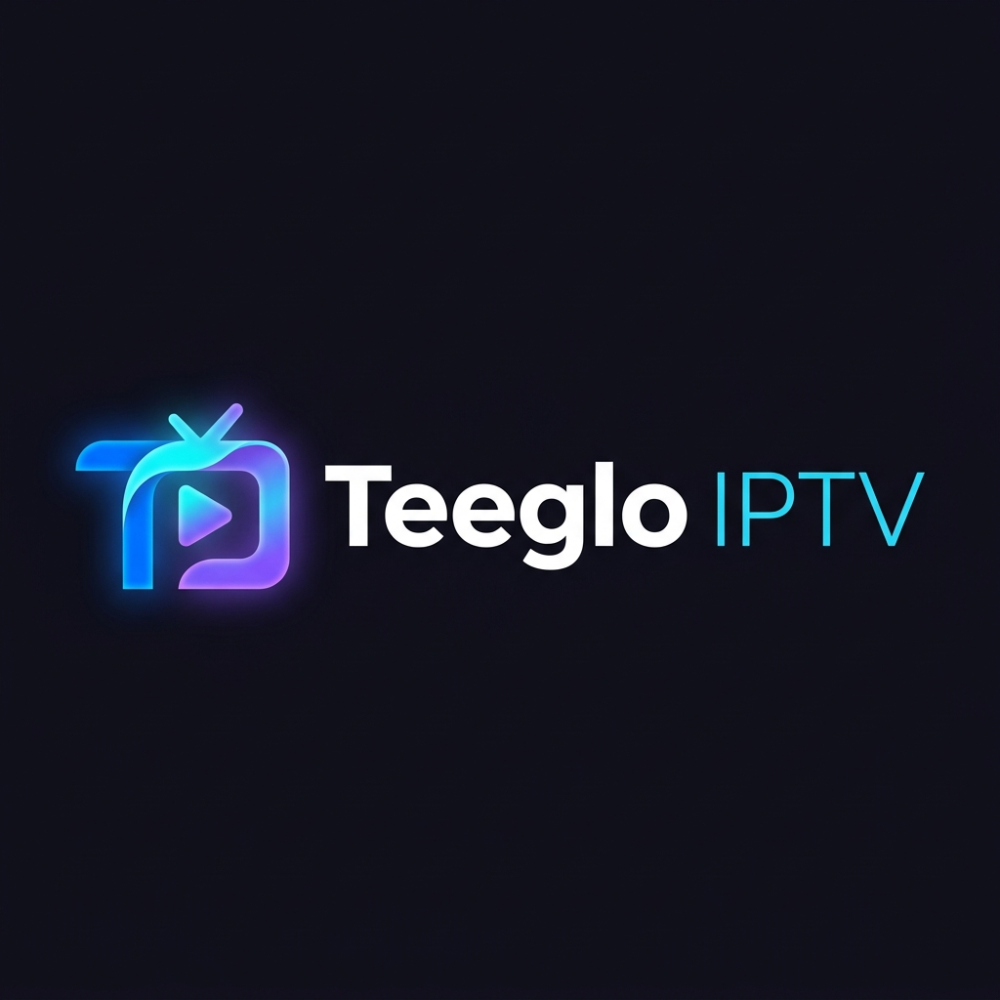

<p align="center">
  
</p>

<p align="center">
  <strong>🚀 An open-source, feature-rich IPTV player built with Flutter</strong>
</p>

<p align="center">
  <a href="#features">Features</a> •
  <a href="#screenshots">Screenshots</a> •
  <a href="#installation">Installation</a> •
  <a href="#building-from-source">Build</a> •
  <a href="#architecture">Architecture</a> •
  <a href="#contributing">Contributing</a> •
  <a href="#license">License</a>
</p>

---

## 🌟 About

**Teeglo IPTV** is a free and open-source IPTV player application for Android (and iOS) built entirely with [Flutter](https://flutter.dev). It allows users to load M3U/M3U8 playlists from any URL or local file, browse channels organized by categories, and stream live TV, movies, and series — all from a single, clean, modern interface.

This project is provided **as-is** for educational and personal use. Teeglo IPTV does **not** provide, host, or distribute any media content. Users are responsible for supplying their own IPTV playlists and ensuring they have the legal rights to access the content.

---

## ✨ Features

### 📺 Core Playback
- **Multiple Import Methods** — Load playlists from remote URLs, local M3U files, or directly log in using Xtream Codes API credentials.
- **High-Performance Video Player** — Powered by [media_kit](https://github.com/media-kit/media-kit) (libmpv) for reliable playback of any stream format (HLS, MPEG-TS, RTMP, HTTP).
- **Adaptive Buffering** — Optimized FFmpeg parameters for fast stream startup and smooth playback.
- **Playback Progress Tracking** — Automatically saves and resumes progress for VOD content (movies, series).

### 📡 Chromecast / Google Cast
- **Cast to TV** — Stream any channel directly to a Chromecast or Google Cast-compatible device on your local network
- **Automatic Device Discovery** — Scans your WiFi network for available Cast receivers
- **HLS Proxy Server** — Built-in FFmpeg-powered local proxy that converts MPEG-TS streams to HLS on the fly for Cast compatibility
- **Background Playback** — Continue casting even when the app is in the background
- **Media Notification Controls** — Play/pause/stop controls from Android's notification shade and lock screen

### ❤️ Favorites
- **Quick Favorites** — Mark channels as favorites directly from the channel list or the player with a single tap
- **Dedicated Favorites Tab** — Quick access to all your saved channels, sorted alphabetically

### 🔍 Browse & Search
- **Category Filtering** — Channels are automatically organized by groups defined in your M3U playlist (e.g., Sports, Movies, News)
- **Real-Time Search** — Instantly filter channels by name as you type
- **Multiple Playlists** — Manage several IPTV playlists simultaneously

### 🎨 User Experience
- **Material Design 3** — Modern, clean UI following the latest Material You design guidelines
- **Dark & Light Themes** — Automatically adapts to your system theme preference
- **Smooth Animations** — Fluid transitions and micro-animations throughout the UI
- **Swipe Navigation** — Navigate between channels with intuitive swipe gestures in the player

---

## 📱 Screenshots

> _Coming soon — Contributions welcome!_

---

## 🛠 Installation

### Prerequisites

- [Flutter SDK](https://docs.flutter.dev/get-started/install) (3.12+)
- [Android Studio](https://developer.android.com/studio) or [VS Code](https://code.visualstudio.com/) with Flutter extension
- Android SDK (API level 21+)
- An Android device or emulator

### Quick Start

```bash
# 1. Clone the repository
git clone https://github.com/your-username/teeglo-iptv.git
cd teeglo-iptv/iptv_app

# 2. Install dependencies
flutter pub get

# 3. Run on a connected device
flutter run
```

### Pre-built APK

You can download the latest pre-built APK (V1.0.0) directly from GitHub:
- [Teeglo IPTV V1.0.0 APK](https://github.com/juanfdo4/teeglo_iptv_opensource/releases/tag/V1.0.0)

---

## 🏗 Building from Source

### Debug Build

```bash
cd iptv_app
flutter run
```

### Release APK

```bash
cd iptv_app
flutter clean
flutter build apk --release
```

The APK will be generated at:
```
build/app/outputs/flutter-apk/app-release.apk
```

### App Icon Generation

The project uses `flutter_launcher_icons` for icon generation. To regenerate app icons after modifying `assets/images/logo.png`:

```bash
flutter pub run flutter_launcher_icons
```

---

## 🏛 Architecture

Teeglo IPTV follows **Clean Architecture** principles, separating the codebase into distinct layers for maintainability and testability.

```
lib/
├── main.dart                          # App entry point, Hive initialization, AudioService setup
│
├── core/                              # Shared utilities and constants
│   ├── error/
│   │   ├── exceptions.dart            # Custom exception types
│   │   └── failures.dart              # Failure types for Either returns
│   └── theme/
│       └── app_theme.dart             # Material 3 light/dark theme definitions
│
├── domain/                            # Business logic layer (pure Dart, no dependencies)
│   ├── entities/
│   │   ├── channel.dart               # Channel entity (Equatable)
│   │   └── playlist.dart              # Playlist entity
│   └── repositories/
│       └── playlist_repository.dart   # Abstract repository contract
│
├── data/                              # Data layer (implementation details)
│   ├── models/
│   │   ├── channel_model.dart         # Channel serialization (JSON ↔ Dart)
│   │   └── playlist_model.dart        # Playlist serialization
│   ├── datasources/
│   │   ├── playlist_remote_data_source.dart  # HTTP fetching of M3U content
│   │   └── playlist_local_data_source.dart   # Hive local persistence
│   ├── repositories/
│   │   └── playlist_repository_impl.dart     # Repository implementation
│   └── utils/
│       └── m3u_parser.dart            # M3U/M3U8 file parser (supports xui-id, tvg-id)
│
└── presentation/                      # UI layer
    ├── home/
    │   ├── pages/
    │   │   ├── main_dashboard.dart     # Main app shell with bottom navigation
    │   │   ├── playlist_details_page.dart    # Playlist channel listing
    │   │   ├── playlist_manager_page.dart    # Add/remove playlists
    │   │   └── favorites_page.dart          # Favorites list view
    │   ├── providers/
    │   │   ├── home_provider.dart            # Home state management
    │   │   ├── active_playlist_provider.dart # Currently selected playlist
    │   │   └── favorites_provider.dart       # Favorites state (Hive-backed)
    │   └── widgets/
    │       ├── channel_list_widget.dart      # Channel list with search & categories
    │       ├── add_playlist_dialog.dart      # Add playlist modal
    │       └── cast_status_indicator.dart    # Chromecast connection status
    │
    └── player/
        ├── pages/
        │   └── video_player_screen.dart     # Full-screen video player
        ├── providers/
        │   ├── cast_provider.dart           # Chromecast state management
        │   └── playback_progress_provider.dart  # VOD progress tracking
        ├── services/
        │   ├── iptv_hls_proxy.dart          # FFmpeg HLS proxy for Cast
        │   └── cast_audio_handler.dart      # AudioService media controls
        └── widgets/
            └── cast_player_controls.dart    # Cast remote control UI
```

### Key Design Decisions

| Decision | Rationale |
|----------|-----------|
| **Clean Architecture** | Separation of concerns makes the codebase testable and maintainable |
| **Riverpod** for state management | Type-safe, compile-time checked, and supports async providers |
| **Hive** for local storage | Lightweight, fast, NoSQL database perfect for mobile |
| **media_kit (libmpv)** | Most reliable cross-platform player, handles all IPTV stream formats |
| **FFmpeg (ffmpeg_kit)** | Enables real-time transcoding of MPEG-TS to HLS for Chromecast |
| **Equatable** | Value equality for entity comparison without boilerplate |
| **dartz (Either)** | Functional error handling without try-catch chains |

---

## 📦 Dependencies

| Package | Purpose |
|---------|---------|
| `flutter_riverpod` | State management |
| `media_kit` / `media_kit_video` | Video playback engine (libmpv) |
| `hive` / `hive_flutter` | Local NoSQL database |
| `dio` | HTTP client for fetching playlists |
| `dart_cast` | Google Cast / Chromecast protocol |
| `ffmpeg_kit_flutter_new` | FFmpeg for stream transcoding |
| `audio_service` | Background playback & media notification controls |
| `flutter_background` | Keep app alive during Cast sessions |
| `flutter_animate` | Smooth UI animations |
| `shelf` / `shelf_static` | Local HTTP server for HLS proxy |
| `dartz` | Functional programming (Either type) |
| `equatable` | Value equality for entities |
| `path_provider` | Access to app directories |
| `file_selector` | Local M3U file selection |

---

## 📋 M3U Playlist Format

Teeglo IPTV supports the standard M3U/M3U8 format used by most IPTV providers. The parser extracts the following attributes:

```m3u
#EXTM3U
#EXTINF:-1 xui-id="12345" tvg-id="channel.id" tvg-name="Channel Name" tvg-logo="https://example.com/logo.png" group-title="Category",Channel Display Name
http://example.com/stream/url
```

### Supported Attributes

| Attribute | Description | Required |
|-----------|-------------|----------|
| `xui-id` | Xtream UI unique identifier (preferred for channel ID) | No |
| `tvg-id` | EPG channel identifier | No |
| `tvg-name` | Channel name for EPG matching | No |
| `tvg-logo` | URL to channel logo image | No |
| `group-title` | Category/group for channel organization | No |

### ID Priority

The parser uses the following priority for generating unique channel IDs:
1. `xui-id` (if present and non-empty)
2. `tvg-id` (if present and non-empty)
3. Stream URL (as ultimate fallback)

All IDs are combined with the stream URL to guarantee absolute uniqueness, even when providers assign duplicate IDs to different channels.

---

## 🤝 Contributing

Contributions are welcome and appreciated! Here's how you can help:

### Getting Started

1. **Fork** the repository
2. **Create** a feature branch: `git checkout -b feature/amazing-feature`
3. **Commit** your changes: `git commit -m 'Add amazing feature'`
4. **Push** to the branch: `git push origin feature/amazing-feature`
5. **Open** a Pull Request

### Contribution Ideas

- 🌍 **Translations** — Help localize the app into more languages
- 📺 **EPG Support** — Integrate Electronic Program Guide (XMLTV)
- 🎨 **UI Themes** — Create additional theme options
- 🧪 **Tests** — Add unit and widget tests
- 📝 **Documentation** — Improve docs, add screenshots, write tutorials
- 🐛 **Bug Fixes** — Check the Issues tab for known bugs
- ✨ **New Features** — VOD categories, series tracking, parental controls

### Code Style

- Follow the [Dart style guide](https://dart.dev/effective-dart/style)
- Run `flutter analyze` before submitting — **zero issues required**
- Use meaningful commit messages
- Keep PRs focused on a single feature or fix

---

## 📄 License

This project is licensed under the **MIT License** — see the [LICENSE](LICENSE) file for details.

```
MIT License

Copyright (c) 2024 Teeglo

Permission is hereby granted, free of charge, to any person obtaining a copy
of this software and associated documentation files (the "Software"), to deal
in the Software without restriction, including without limitation the rights
to use, copy, modify, merge, publish, distribute, sublicense, and/or sell
copies of the Software, and to permit persons to whom the Software is
furnished to do so, subject to the following conditions:

The above copyright notice and this permission notice shall be included in all
copies or substantial portions of the Software.

THE SOFTWARE IS PROVIDED "AS IS", WITHOUT WARRANTY OF ANY KIND, EXPRESS OR
IMPLIED, INCLUDING BUT NOT LIMITED TO THE WARRANTIES OF MERCHANTABILITY,
FITNESS FOR A PARTICULAR PURPOSE AND NONINFRINGEMENT. IN NO EVENT SHALL THE
AUTHORS OR COPYRIGHT HOLDERS BE LIABLE FOR ANY CLAIM, DAMAGES OR OTHER
LIABILITY, WHETHER IN AN ACTION OF CONTRACT, TORT OR OTHERWISE, ARISING FROM,
OUT OF OR IN CONNECTION WITH THE SOFTWARE OR THE USE OR OTHER DEALINGS IN THE
SOFTWARE.
```

---

## ⚠️ Disclaimer

**Teeglo IPTV** is an open-source media player application. It does **not** provide, host, aggregate, or distribute any media content. The application is a tool that allows users to load and play their own M3U playlists.

- Users are solely responsible for the content they access through this application
- Users must ensure they have the legal rights to access any streams they load
- The developers of this project are not responsible for any misuse of the application
- This project is not affiliated with any IPTV service provider

---

## 💬 Support

- **Issues**: [GitHub Issues](https://github.com/your-username/teeglo-iptv/issues)
- **Discussions**: [GitHub Discussions](https://github.com/your-username/teeglo-iptv/discussions)

---

<p align="center">
  Made with ❤️ and Flutter
</p>
